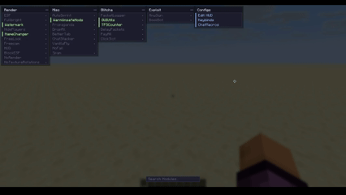
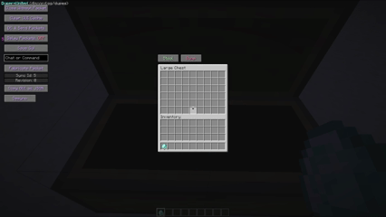
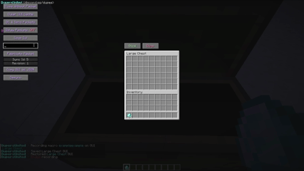
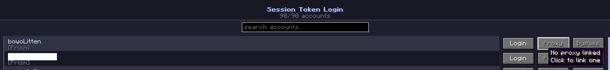
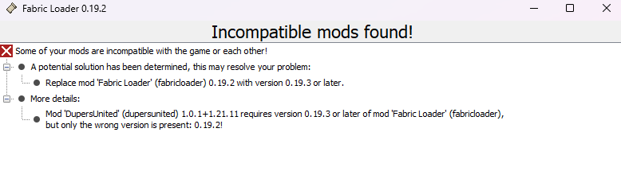
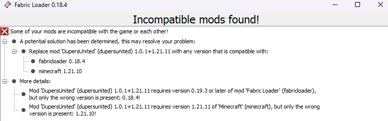

# Frequently Asked Questions 
If your question isn't answered here, feel free to create a ticket in our [Discord](https://discord.gg/dupes).

# Getting Started

## What version is this mod for?
This mod is for **Minecraft 26.2**.

## How do I install the mod? / How do I install Fabric?
Go to the [Fabric](https://fabricmc.net/) website and click Download to download the [Fabric Installer](https://fabricmc.net/use/installer/). Open the installer, then select:

> Minecraft Version: **26.2**
>
> Loader Version: **0.19.3**

Click Install. Once the installation is complete, you'll need to install [Fabric API](https://modrinth.com/mod/fabric-api/version/0.141.5+1.21.11), return to the Fabric website and click Download Fabric API. Download the version of Fabric API that matches Minecraft 26.2.

After downloading it, place the Fabric API .jar file into your .minecraft/mods folder. If you're unsure how to install mods, check out the [installation guide](https://docs.fabricmc.net/players/installing-mods) on the Fabric website.

Finally, place the [DupersUnited](https://github.com/DupersUnited/dupersunited-mod/releases/) mod .jar file into the same mods folder. You can then launch Minecraft using the Fabric installation, and the DupersUnited mod should load automatically.

# Features & Usage

## How do I select which packets to pause?
You have to open the ClickGUI, click on "Delay Packets", you can customize which packets listed get paused while you have delay packets on.

If you're confused, refer to the GIF above.

## How do I use MacroGUI?
MacroGUI lets you record actions you perform inside a GUI and play them back later.

### Recording a GUI Macro

There are two ways to start recording a macro:

> Use a keybind you've assigned to Record Macro.
>
> Run /du macrogui record (name) (gui title).

Once recording starts, you'll be notified in-game. From there, you can perform any actions you want to include in the macro, such as:

> Clicking buttons or slots
>
> Delaying packets through the GUI
>
> Soft closing the GUI
>
> Running commands
>
> Sending chat messages

Everything you do while recording will be saved to the macro. (*saved in DupersUnited/macros/*)

When you're finished, click the End Recording button or run /du macrogui finish

### Using the GUI Macro

Once you've recorded a macro, you can run it in two ways, by running /du macrogui run (name) or by assigning the macro to a keybind and press the assigned key.

## What is a proxy?
A proxy is a server that acts as an intermediary between your device and the internet. It routes your traffic while hiding your IP address.

### How do I use proxies in the mod?

We recommend you use [LiquidProxy](https://liquidproxy.net/) or [Webshare](https://www.webshare.io/), Both of these are **paid services**.

### How do I add a proxy?

On the main screen, click DupersUnited.

1. Open Proxy Manager.
2. Enter your proxy details.
3. Save the proxy.

Your proxy is now available to use in the mod.

### How do I link to a proxy?

On the main screen, click DupersUnited.

1. Open Accounts.
   

2. Click Proxy.
3. Select the proxy you want to assign to that account.

# FAQ & Troubleshooting

## What do these errors mean?

### Outdated Fabric Loader

This error means your fabric loader version is **outdated**! You'll need to follow the steps above to download the latest fabric loader version.

### Incorrect Minecraft Version

This error means you are **not** running the correct version of Minecraft. This mod requires **Minecraft 26.2**.

## Can I use this mod on my phone/with pojav?

No, we do not support pojav launcher and we **don't** plan on offering any support for it.

## Is this a RAT?

No, please feel free to go through our code as we're fully open source, make sure you are downloading the mods from the **official** source (this GitHub repository or our Discord server). If you have any questions about anything in our mods code feel free to open a ticket in our discord server under "Mod Support"